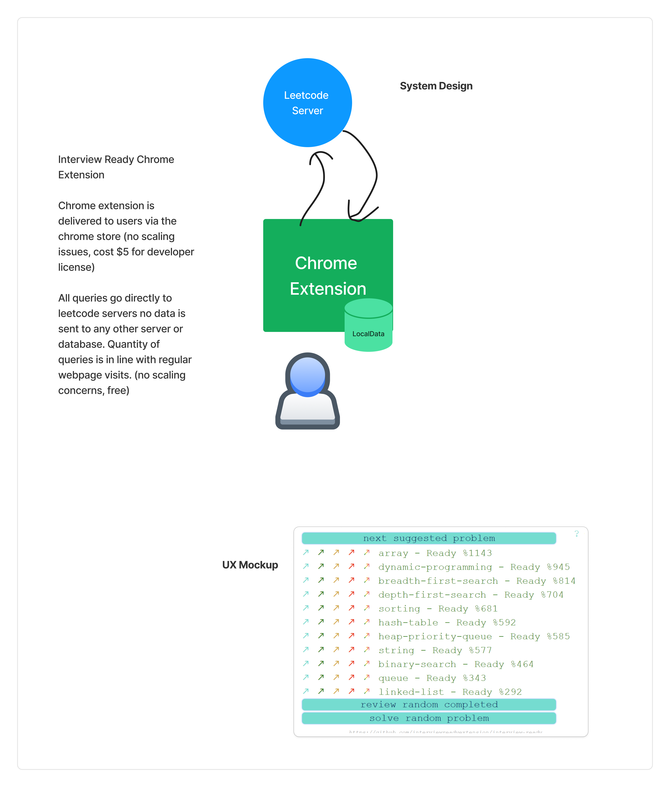

# Recommended Readings

## Data InfoGraphics (Velocity and Volume)
https://www.domo.com/learn/infographic/data-never-sleeps-11
https://www.domo.com/learn/infographic/data-never-sleeps-12

## Consistent Hashing (horizontal scaling concepts)
https://www.youtube.com/watch?v=UF9Iqmg94tk

## Backups, multi-writes, consensus explained (Cassandra)
https://medium.com/jorgeacetozi/cassandra-architecture-and-write-path-anatomy-51e339bcfe0c

## Sample System Designs
- Uber (complicated): https://www.geeksforgeeks.org/system-design-of-uber-app-uber-system-architecture/
- Super Simple Design (https://chromewebstore.google.com/detail/interview-ready/llicapjcmjifdbafkbicgplkmamfchmd?authuser=2&hl=en)
